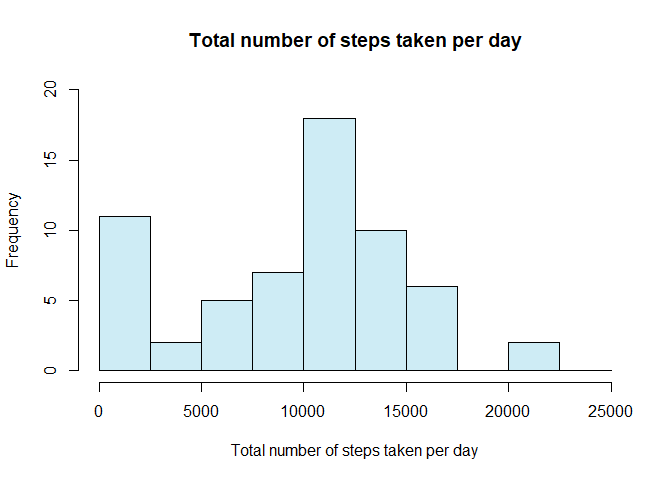
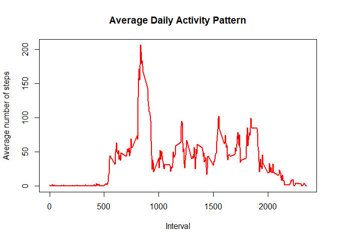
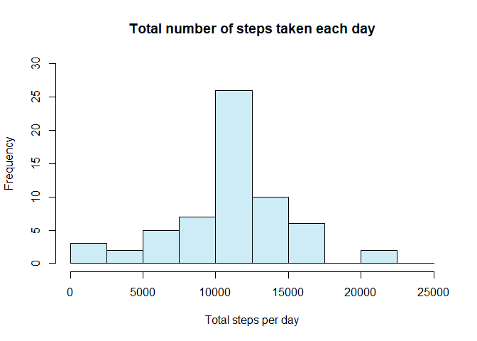
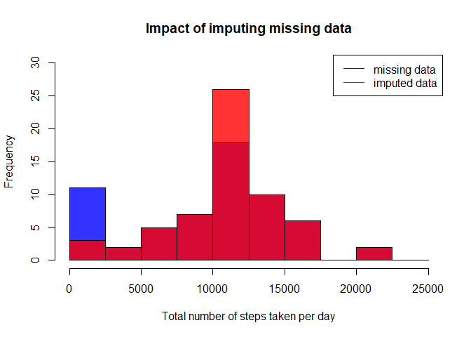
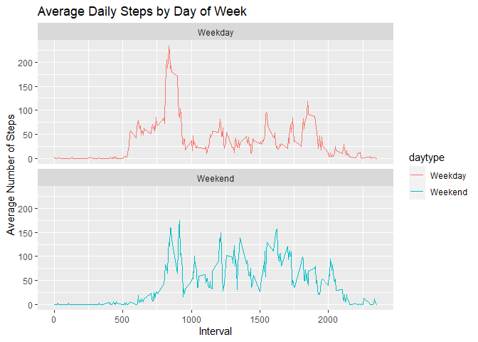

## Loading and preprocessing the data  
- Load required library (ggplot2)  
- Process / transform the data from "activity.csv" for analysis    
- View the snapshot summary data of "activity"  
  
    

```r
library(ggplot2)
activity <- read.csv("./activity/activity.csv")
activity$date <- as.POSIXct(activity$date, "%Y-%m-%d", tz = "America/Chicago")
weekday <- weekdays(activity$date)
activity <- cbind(activity,weekday)

summary(activity)
```

```
##      steps             date                        interval     
##  Min.   :  0.00   Min.   :2012-10-01 00:00:00   Min.   :   0.0  
##  1st Qu.:  0.00   1st Qu.:2012-10-16 00:00:00   1st Qu.: 588.8  
##  Median :  0.00   Median :2012-10-31 00:00:00   Median :1177.5  
##  Mean   : 37.38   Mean   :2012-10-31 00:25:34   Mean   :1177.5  
##  3rd Qu.: 12.00   3rd Qu.:2012-11-15 00:00:00   3rd Qu.:1766.2  
##  Max.   :806.00   Max.   :2012-11-30 00:00:00   Max.   :2355.0  
##  NA's   :2304                                                   
##    weekday         
##  Length:17568      
##  Class :character  
##  Mode  :character  
##                    
##                    
##                    
## 
```
  
  
## What is mean total number of steps taken per day?  
- Calculating the total number of steps taken per day(missing data ignored)  
- Create a histogram showing the total number of steps taken each day  
- Calculating the mean and median values  

```r
total_steps <- with(activity, aggregate(steps, by = list(date), FUN = sum, na.rm = TRUE))
names(total_steps) <- c("date", "steps")
hist1 <- hist(total_steps$steps, main = "Total number of steps taken per day", xlab = "Total number of steps taken per day", col = "#CEECF5", ylim = c(0,20), breaks = seq(0,25000, by=2500))
```

<!-- -->
  
### Mean  

```r
mean(total_steps$steps)
```

```
## [1] 9354.23
```

### Median  

```r
median(total_steps$steps)
```

```
## [1] 10395
```
  
## What is the average daily activity pattern?  

```r
avg_daily_activity <- aggregate(activity$steps, by=list(activity$interval), FUN=mean, na.rm=TRUE)
names(avg_daily_activity) <- c("interval", "mean")
plot(avg_daily_activity$interval, avg_daily_activity$mean, type = "l", col="Red", lwd = 2, xlab="Interval", ylab="Average number of steps", main="Average Daily Activity Pattern")
```

<!-- -->
  
    
## Imputing missing values

- Calculating and reporting the total number of missing values in the dataset (i.e. the total number of rows with NAs)  


```r
sum(is.na(activity$steps))
```

```
## [1] 2304
```

- Using the mean for the day as a strategy for filling in all of the missing values in the dataset.  


```r
imputing_missing_values <- avg_daily_activity$mean[match(activity$interval, avg_daily_activity$interval)]
```


- Creating a new dataset that is equal to the original dataset but with the missing data filled in.

```r
new_activity <- transform(activity, steps = ifelse(is.na(activity$steps), yes = imputing_missing_values, no = activity$steps))
missing_values_added <- aggregate(steps ~ date, new_activity, sum)
names(missing_values_added) <- c("date", "daily_steps")
```
  
  
## Make a histogram of the total number of steps taken each day and Calculate and report the mean and median total number of steps taken per day. Do these values differ from the estimates from the first part of the assignment? What is the impact of imputing missing data on the estimates of the total daily number of steps?**
  
- Histogram of the total number of steps taken each day  


```r
hist2 <- hist(missing_values_added$daily_steps, col = "#CEECF5", xlab = "Total steps per day", ylim = c(0,30), main = "Total number of steps taken each day", breaks = seq(0,25000,by=2500))
```

<!-- -->
  
- Calculate and report the mean and median total number of steps taken per day  

### Updated Mean

```r
mean(missing_values_added$daily_steps)
```

```
## [1] 10766.19
```

- Difference between earlier calaculation of mean and 'updated mean'  

```r
Difference_Mean <- mean(missing_values_added$daily_steps) - mean(total_steps$steps)
Difference_Mean
```

```
## [1] 1411.959
```


### Updated Median

```r
median(missing_values_added$daily_steps)  
```

```
## [1] 10766.19
```

- Difference between earlier calaculation of median and 'updated median'  

```r
Difference_Median <- median(missing_values_added$daily_steps) - median(total_steps$steps)
Difference_Median  
```

```
## [1] 371.1887
```
  
- Impact of imputing missing data on the estimates of the total daily number of steps  


```r
plot(hist1, main = "Impact of imputing missing data", xlab="Total number of steps taken per day", ylab="Frequency",col= "#0000FFCC", xlim=c(0,25000), ylim=c(0,30))
plot(hist2, add = TRUE, col = "#FF0000CC")
legend("topright",legend=c("missing data","imputed data"),lty=1,col=c("blue", "red"),cex=1)
```

<!-- -->

## Are there differences in activity patterns between weekdays and weekends?  

- Create a new variable to identify week days and weekends  

```r
activity$day <- as.Date(strptime(activity$date, format="%Y-%m-%d"))
activity$daytype <- sapply(activity$date, function(x) {
        if (weekdays(x) == "Saturday" | weekdays(x) =="Sunday") 
                {y <- "Weekend"} else 
                {y <- "Weekday"}
                y
        })
```

- Create a time series plot showing the 5 minute intervals on the  x-axis, and the average number of steps taken on the y-axis to show the pattern between weekdays and weekends    

```r
activity_by_day <- aggregate(steps~interval + daytype, activity, mean, na.rm = TRUE)
plot<- ggplot(activity_by_day, aes(x = interval , y = steps, color = daytype)) +
       geom_line() +
       labs(title = "Average Daily Steps by Day of Week", x = "Interval", y = "Average Number of Steps") +
       facet_wrap(~daytype, ncol = 1, nrow=2)
print(plot)
```

<!-- -->

